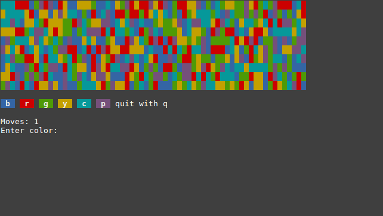

# pixelated

This is an implementation of the game pixelated.

The goal of the game is to fill up the board with a single color starting at
the top left corner. You do this by changing the color of the top left corner
tile to a different color. When you do that, all connected tiles of the same
color also flip to that color. You continue changing the colors of the tiles
connected to that top left corner until every tile is the same color.

## Demo



## Usage

To run this project, you need to have the [Rust][rust] programming language
installed.

Then you can run standard cargo commands to play the game:

```
cargo run
```

[rust]: https://www.rust-lang.org/
